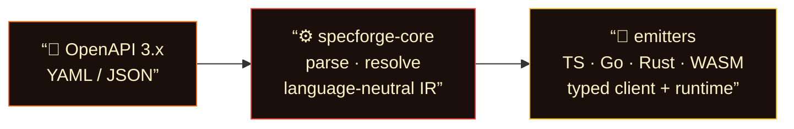
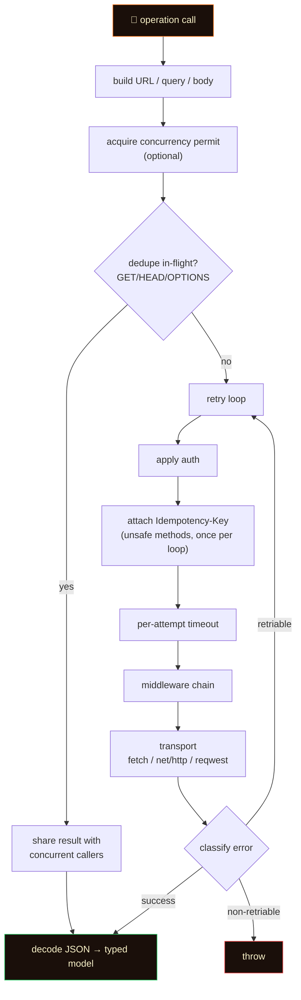

<p align="center">
  
</p>

<p align="center">
  <strong>Forge production-ready client SDKs from OpenAPI 3.x specs.</strong><br/>
  One language-neutral IR. Emitters for <b>TypeScript</b>, <b>Go</b>, <b>Rust</b>, and <b>WASM</b>.<br/>
  With runtime validation, documentation generation, and a plugin system.
</p>

<p align="center">
  <a href="#quick-start"></a>
  <a href="#features"></a>
  <a href="#testing--ci"></a>
  <a href="CHANGELOG.md"></a>
  <a href="#license"></a>
</p>

<p align="center">
  
</p>

---

## Why specforge?

Most OpenAPI generators have critical shortcomings that leave teams building runtime infrastructure by hand:

| Problem with other generators | specforge’s answer |
|---|---|
| **Incomplete types** — nullable, oneOf, allOf produce broken or `any`-typed output | Full composition support: allOf property merging, oneOf type guards, discriminator mapping, nullable propagation |
| **No runtime** — you get types but no client, auth, retry, or error handling | Production-ready runtime: auth providers, exponential backoff, pagination helpers, concurrency control, middleware, idempotency keys, SSE streaming |
| **Single language** — each generator is a silo with different behavior | One IR, four targets: TypeScript, Go, Rust, and WASM plugins share the same resolved spec |
| **No validation** — generated code trusts the server blindly | Runtime request/response validation catches contract violations in dev and tests |
| **No testing** — you write mock servers by hand | `specforge test` generates mock server tests from example responses |
| **No documentation** — separate tools for API docs | `specforge docs` generates a static HTML documentation site |
| **No CI integration** — manual diffing and linting | `specforge diff` detects breaking changes, `specforge check` lints specs, GitHub Action for one-line CI |

### The specforge advantage

**1. Parse once, emit many**

Your OpenAPI spec is parsed and resolved into a language-neutral IR (Intermediate Representation). Every emitter — TypeScript, Go, Rust, or a custom WASM plugin — walks the same IR. This means:

- Consistent behavior across languages (same retry logic, same pagination, same auth)
- Adding a new language means writing one emitter, not re-implementing the parser
- The IR is a documented, versioned JSON schema (`assets/ir-schema.json`)

**2. SDKs that actually work in production**

specforge doesn’t just generate types — it generates **complete client libraries** with:

- **Auth** — Bearer tokens (static or dynamic), API keys, custom providers
- **Retry** — Full-jitter exponential backoff with configurable max retries and per-attempt timeouts
- **Pagination** — Cursor and offset pagination helpers that walk all pages automatically
- **Concurrency** — Async semaphore to limit in-flight requests (`maxConcurrent`)
- **Deduplication** — In-flight request coalescing for GET/HEAD/OPTIONS (one upstream call, N waiters)
- **Middleware** — Composable request/response middleware chain (logging, tracing, header injection)
- **Idempotency** — Automatic `Idempotency-Key` headers on POST/PUT/PATCH/DELETE
- **Streaming** — SSE and chunk streaming helpers with proper error handling
- **Validation** — Runtime request/response body validation against the spec

**3. Multi-language with one source of truth**

Generate SDKs for all your teams from the same spec:



Each generated SDK is a standalone project — no shared runtime dependency, no version coupling. The TypeScript SDK is a dual ESM/CJS package, the Go SDK uses only stdlib, and the Rust SDK uses `reqwest` + `serde`.

**4. Built for CI**

- `specforge check` lints your spec with configurable rules (`.specforge.yaml`)
- `specforge diff` detects breaking changes between two spec versions — exit code 1 on breaking changes
- GitHub Action for one-line CI integration
- Deterministic output for reproducible builds and effective caching

**5. Extensible via WASM plugins**

Need Kotlin? Swift? Python? Build a custom emitter as a WASM plugin:

```rust
use specforge_plugin::{Plugin, PluginResult, GeneratedFile};

struct MyPlugin;
impl Plugin for MyPlugin {
    fn generate(&self, ir_json: &str) -> PluginResult {
        // Parse the IR, emit files for your language
    }
}
specforge_plugin::export_plugin!(MyPlugin);
```

The plugin receives the full IR as JSON and returns generated files. Compile to WASM and run with `specforge`.

---

## Features

### Spec parsing & resolution

| Feature | Benefit |
|---|---|
| **OpenAPI 3.0 + 3.1** | Handles both spec versions transparently. 3.1 `type` arrays, `$ref` siblings, and numeric `exclusiveMinimum` are auto-converted to 3.0 for parsing. |
| **Full `$ref` resolution** | Named types stay named — no exponential inlining blow-ups. Self-referential and mutual `$ref` cycles are safe by construction. |
| **Composition support** | `allOf` merges properties (last-wins, required union). `oneOf`/`anyOf` generate type guards. Discriminator mapping preserved. |
| **AllOf type aliases** | When allOf has one `$ref` member, Go emits embedded structs and Rust emits `#[serde(flatten)]` — proper composition, not flat merging. |
| **Deterministic output** | `IndexMap` preserves spec order. Same spec + same version = identical output. Bit-stable for caching and diffing. |
| **Spec linting** | 8 configurable rules (duplicate operation IDs, missing descriptions, unused schemas, etc.) with `.specforge.yaml` config. |
| **Breaking change detection** | `specforge diff` compares two specs: removed operations, new required parameters, type changes. Exit code 1 for CI gates. |

### Generated SDK runtimes

Every generated SDK is a **complete, production-ready client** — not just types.

| Capability | What it does | Why it matters |
|---|---|---|
| **Typed models + operations** | Full request/response types with proper optionality | Catch type errors at compile time, not in production |
| **Auth providers** | Bearer (static/dynamic), API key (header/query), custom | Swap credentials without touching client code |
| **Retry + backoff** | Full-jitter exponential backoff, configurable max retries | Handle transient failures gracefully without thundering herd |
| **Per-attempt timeouts** | Configurable timeout on each retry attempt | Prevent hung requests from blocking your app |
| **Pagination helpers** | Cursor and offset pagination that walks all pages | One call instead of manual loop + cursor management |
| **Concurrency semaphore** | `maxConcurrent` limits in-flight requests | Prevent overwhelming the API or hitting rate limits |
| **In-flight dedupe** | Coalesces identical GET/HEAD/OPTIONS requests | N concurrent callers → 1 upstream call, N shared results |
| **Middleware chain** | Composable request/response middleware | Add logging, tracing, header injection without modifying the client |
| **Idempotency keys** | Auto-generated `Idempotency-Key` on unsafe methods | Safe retries on POST/PUT/PATCH/DELETE without duplicate side effects |
| **SSE streaming** | Server-Sent Event parser with proper error handling | Real-time data streams without manual parsing |
| **Runtime validation** | Validate request/response bodies against the spec | Catch API contract violations in dev and tests, not production |
| **oneOf type guards** | `isPetCreated()`, `narrowPetEvent()` (TS); `is_pet_created()`, `discriminant()` (Rust) | Safely narrow union types at runtime |

### Language-specific highlights

**TypeScript**
- Dual ESM/CJS package (`sideEffects: false` for tree-shaking)
- Native `fetch` — no runtime dependencies
- Discriminated union error types (`ApiError`)
- `isX()` / `narrowX()` type guards for oneOf unions
- Per-model `validatePet()` functions

**Go**
- Stdlib only (`net/http`, `encoding/json`) — zero third-party dependencies
- Embedded structs for allOf composition
- `New{Union}(m map[string]any)` for discriminated oneOf deserialization
- `New{Union}FromJSON(raw json.RawMessage)` for non-discriminated unions
- `WithValidation(true)` for runtime request/response checking

**Rust**
- `reqwest` + `serde` + `tokio` async runtime
- `#[serde(flatten)]` for allOf composition
- `impl PetEvent { fn discriminant() -> &str; fn is_pet_created() -> bool; }` for oneOf
- `SseStream` for SSE parsing over `bytes_stream()`
- `.validation(true)` builder option

**WASM plugins**
- `specforge-plugin` crate with `Plugin` trait and `export_plugin!` macro
- Receives full IR as JSON, returns generated files
- Compile to `wasm32-wasi` for any language emitter

### CLI subcommands

| Command | What it does |
|---|---|
| `specforge generate` | Generate an SDK from an OpenAPI spec |
| `specforge check` | Lint and validate a spec with configurable rules |
| `specforge diff` | Compare two specs and report breaking changes |
| `specforge emit` | Dump the resolved IR as JSON (for external tools) |
| `specforge init` | Scaffold a new OpenAPI spec with a `/health` endpoint |
| `specforge convert` | Convert between OpenAPI 3.0 and 3.1 |
| `specforge merge` | Merge multiple spec files into one |
| `specforge migrate` | Generate a migration guide between two spec versions |
| `specforge docs` | Generate a static HTML API documentation site |
| `specforge test` | Generate mock server tests from spec examples |
| `specforge versions` | List API versions in a spec directory |
| `specforge workspace` | Generate SDKs for all specs in a workspace config |

### Quality gates

- **169+ unit tests** across core, emitters, and CLI
- **Regression suite** on petstore (vendored) + GitHub / Stripe (large real-world specs)
- **Compile gates**: generated Go must `go build`, generated Rust must `cargo check`
- **E2E smoke**: mock server × list/show/create + auth/retry/pagination (all 3 langs)
- **E2E advanced**: concurrency serialisation, dedupe single-flight, middleware rewrite, idempotency-key on POST, SSE parse (all 3 langs)
- **Multi-platform CI**: Linux, macOS, Windows (GitHub Actions matrix)
- **Cross-compiled releases**: 5 targets (linux amd64/arm64, macOS Intel/Apple Silicon, Windows)

---

## Quick start

### 1. Build the CLI

```bash
cargo build -p specforge-cli
# → target/debug/specforge
```

### 2. Generate an SDK

```bash
# TypeScript (default) — native fetch, dual ESM/CJS package
./target/debug/specforge generate openapi.yaml -o ./sdk-ts -l ts

# Go — stdlib net/http only
./target/debug/specforge generate openapi.yaml -o ./sdk-go -l go \
  -n github.com/acme/widget-go

# Rust — reqwest + serde
./target/debug/specforge generate openapi.yaml -o ./sdk-rs -l rust \
  -n widget_sdk

# Lint a spec without generating
./target/debug/specforge check openapi.yaml
./target/debug/specforge check openapi.yaml --strict
```

### 3. Call your API

<details open>
<summary><b>TypeScript</b></summary>

```ts
import { createClient, bearerAuth, streamSse } from "./sdk-ts/src/index.ts";

const client = createClient({
  baseUrl: "https://api.example.com",
  auth: bearerAuth(() => process.env.API_TOKEN!),
  maxConcurrent: 8,
  dedupe: true,
  idempotency: true,
  retry: { maxRetries: 3 },
});

const page = await client.pets.listPets({ limit: 20 });

// Streaming (SSE)
const res = await client.request("GET", "/events");
for await (const ev of streamSse(res)) {
  console.log(ev.event, ev.data);
}
```

</details>

<details>
<summary><b>Go</b></summary>

```go
c := sdk.NewClient().
    WithBaseURL("https://api.example.com").
    WithBearerToken(os.Getenv("API_TOKEN")).
    WithTimeout(10 * time.Second).
    WithMaxConcurrent(8).
    WithDedupe(true).
    WithIdempotency(true).
    WithRetry(sdk.DefaultRetryOptions())

c.Use(func(ctx context.Context, req *sdk.MiddlewareRequest, next func(context.Context, *sdk.MiddlewareRequest) (*sdk.MiddlewareResponse, error)) (*sdk.MiddlewareResponse, error) {
    start := time.Now()
    res, err := next(ctx, req)
    log.Printf("%s %s %v", req.Method, req.URL, time.Since(start))
    return res, err
})

pets, err := c.ListPets(ctx, 20)

// Streaming SSE
res, err := c.DoStream(ctx, "GET", "/events", nil, nil)
defer sdk.DrainAndClose(res)
it := sdk.NewSseIterator(res)
for it.Next() {
    ev := it.Event()
    fmt.Println(ev.Event, ev.Data)
}
```

</details>

<details>
<summary><b>Rust</b></summary>

```rust
use std::time::Duration;
use widget_sdk::{api, Client};
use widget_sdk::streaming::SseStream;

let client = Client::builder()
    .base_url("https://api.example.com")
    .bearer_token(std::env::var("API_TOKEN")?)
    .timeout(Duration::from_secs(10))
    .max_concurrent(8)
    .dedupe(true)
    .idempotency(true)
    .build()?;

let pets = api::list_pets(&client, Some(20)).await?;

// Streaming SSE
let res = client.request_stream(reqwest::Method::GET, "/events", &[], None).await?;
let mut sse = SseStream::new(res.bytes_stream());
while let Some(ev) = sse.next_event().await? {
    println!("{}: {}", ev.event, ev.data);
}
```

</details>

---

## CLI reference

```text
specforge <COMMAND>

Commands:
  generate        Generate an SDK from an OpenAPI spec
  check           Lint and validate an OpenAPI spec without generating
  diff            Compare two OpenAPI specs and report breaking changes
  emit            Emit the resolved IR as JSON (for external emitters / plugins)
  init            Scaffold a new minimal OpenAPI spec
  convert         Convert between OpenAPI 3.0 and 3.1
  merge           Merge multiple OpenAPI spec files into one
  migrate         Generate a migration guide between two spec versions
  docs            Generate static HTML API documentation
  test            Generate mock server tests for generated SDKs
  versions        List API versions in a spec directory
  workspace       Generate SDKs for all specs in a workspace config
  workspace-init  Generate a workspace config from a directory
  help            Print this message or the help of the given subcommand
```

### `specforge generate`

```text
specforge generate [OPTIONS] <SPEC>

Arguments:
  <SPEC>   Path to OpenAPI YAML or JSON

Options:
  -o, --out <DIR>           Output directory            [default: ./generated]
  -l, --lang <LANG>         ts | go | rust              [default: ts]
  -n, --name <NAME>         Package / module / crate name override
  --version <VERSION>       API version (when spec is a directory)
  --profile                 Output timing breakdown for each pipeline stage
  -v, --log-level <LEVEL>   error|warn|info|debug|trace [default: info]
  -h, --help
  -V, --version
```

| Language | `-n` means | Default if omitted |
|----------|------------|--------------------|
| **ts** | npm package name in `package.json` | `@<title-slug>sdk` |
| **go** | Go module path in `go.mod` | `github.com/example/<title>-go` |
| **rust** | Cargo crate name | `<title>_sdk` |

### `specforge check`

```text
specforge check [OPTIONS] <SPEC>

Arguments:
  <SPEC>   Path to OpenAPI YAML or JSON

Options:
  --strict                   Treat warnings as errors
  -v, --log-level <LEVEL>    error|warn|info|debug|trace [default: info]
```

### `specforge diff`

```text
specforge diff [OPTIONS] <OLD> <NEW>

Arguments:
  <OLD>   Path to the old (baseline) OpenAPI spec
  <NEW>   Path to the new OpenAPI spec

Options:
  --breaking-only              Show only breaking changes
  -v, --log-level <LEVEL>      error|warn|info|debug|trace [default: info]
```

Exit code 1 if breaking changes are found — use in CI to gate releases.

### `specforge emit`

```text
specforge emit [OPTIONS] <SPEC>

Arguments:
  <SPEC>   Path to OpenAPI YAML or JSON

Options:
  -v, --log-level <LEVEL>    error|warn|info|debug|trace [default: warn]
```

Outputs the resolved IR as pretty-printed JSON to stdout. Use this to build external emitters:

```bash
specforge emit openapi.yaml | my-custom-emitter --input - --output ./sdk
```

### `specforge docs`

```text
specforge docs [OPTIONS] <SPEC>

Arguments:
  <SPEC>   Path to OpenAPI YAML or JSON

Options:
  -o, --out <DIR>           Output directory [default: ./docs]
  -v, --log-level <LEVEL>   error|warn|info|debug|trace [default: info]
```

Generates a static HTML documentation site with color-coded HTTP method badges, schema listings, and the base URL.

### `specforge test`

```text
specforge test [OPTIONS] <SPEC>

Arguments:
  <SPEC>   Path to OpenAPI YAML or JSON

Options:
  -o, --out <DIR>           Output directory [default: ./tests]
  -l, --lang <LANG>         ts | go | rust              [default: ts]
  -v, --log-level <LEVEL>   error|warn|info|debug|trace [default: info]
```

Generates mock server test files that start a local HTTP server from the spec's example responses and verify the SDK can call each operation. Supports TypeScript (`http` module), Go (`httptest`), and Rust (`TcpListener`).

### `specforge versions`

```text
specforge versions [OPTIONS] <SPEC>

Arguments:
  <SPEC>   Path to a spec file or directory containing versioned specs

Options:
  -v, --log-level <LEVEL>   error|warn|info|debug|trace [default: info]
```

Lists all API versions found in a directory. Supports flat (`v1.yaml`, `v2.yaml`) and nested (`v1/openapi.yaml`, `v2/openapi.yaml`) conventions. Use with `specforge generate specs/ --version v2` to generate for a specific version.

### `specforge migrate`

```text
specforge migrate [OPTIONS] <OLD> <NEW>

Arguments:
  <OLD>   Path to the old (baseline) OpenAPI spec
  <NEW>   Path to the new OpenAPI spec

Options:
  -o, --out <FILE>          Output file (default: stdout)
  -v, --log-level <LEVEL>   error|warn|info|debug|trace [default: info]
```

Generates a migration guide in Markdown format comparing two spec versions. Lists deprecated operations, removed operations, new required parameters, and schema changes.

---

## Architecture

specforge is a **Cargo workspace** with a hard boundary: emitters never touch `openapiv3` types. They only see the IR.

```text
specforge/
├── crates/
│   ├── specforge-core/     # parse · $ref resolve · IR
│   ├── specforge-ts/       # TypeScript emitter + rich runtime templates
│   ├── specforge-go/       # Go emitter (stdlib HTTP client)
│   ├── specforge-rust/     # Rust emitter (reqwest + serde)
│   ├── specforge-wasm/     # WASM target for browser-based parsing
│   ├── specforge-plugin/   # Plugin SDK for WASM emitter plugins
│   └── specforge-cli/      # `specforge` binary + regression / e2e tests
├── fixtures/
│   ├── petstore.yaml       # small vendored fixture (always online)
│   └── sample-api.yaml     # auth · oneOf · cursor pagination sample
├── examples/               # consumer stubs (regenerate via script)
├── scripts/
│   ├── ci.sh               # local CI mirror
│   └── generate-examples.sh
├── assets/                 # logo + banner
├── CHANGELOG.md
├── RELEASE.md
└── .github/workflows/ci.yml
```

### Pipeline stages

| Stage | Crate | Responsibility |
|-------|-------|----------------|
| **Parse** | `specforge-core` | YAML/JSON → `openapiv3::OpenAPI` |
| **Resolve** | `specforge-core` | `$ref`s, security schemes, operations → `Document` IR |
| **Emit** | `specforge-{ts,go,rust}` | IR → idiomatic project on disk |
| **WASM** | `specforge-wasm` | Core parsing/resolving compiled to WASM for browser use |
| **Plugins** | `specforge-plugin` | SDK for building custom WASM emitter plugins |
| **Orchestrate** | `specforge-cli` | CLI flags, logging, language dispatch |

### IR highlights

```rust
// Simplified view of crates/specforge-core/src/ir.rs
pub struct Document {
    pub title: String,
    pub version: String,
    pub base_url: Option<String>,
    pub security: Vec<SecurityScheme>,
    pub schemas: SchemaRegistry,   // named models, stable order
    pub operations: Vec<Operation>,
}

pub enum Type {
    Scalar(Scalar),
    StringEnum { variants: Vec<String>, nullable: bool },
    Array { item: Box<Type>, nullable: bool },
    Map { value: Box<Type> },
    Reference { name: String, nullable: bool },
    Composition(Composition),  // allOf | oneOf | anyOf + optional Discriminator
    Any,
    Unknown,
}
```

Design rules that keep large specs tractable (GitHub ~965 schemas / 1209 ops, Stripe ~1431 / 587):

- **References stay references** — no exponential inlining  
- **Cycles are safe** — self-`$ref` becomes a plain name  
- **Determinism** — `IndexMap` preserves spec order for bit-stable output  

---

## Generated project layouts

<details open>
<summary><b>TypeScript</b> <code>-l ts</code></summary>

```text
sdk-ts/
├── package.json          # dual ESM/CJS, sideEffects: false
├── tsconfig.json         # strict TS 5.6+
├── tsup.config.ts
├── README.md
└── src/
    ├── index.ts          # createClient() + re-exports
    ├── client.ts         # fetch core
    ├── auth.ts
    ├── retry.ts
    ├── paginate.ts
    ├── concurrency.ts    # async semaphore
    ├── dedup.ts          # in-flight GET coalescing (buffered bodies)
    ├── middleware.ts
    ├── idempotency.ts    # Idempotency-Key generation
    ├── streaming.ts      # streamBytes / streamLines / streamSse
    ├── errors.ts         # discriminated-union ApiError
    ├── models/<Name>.ts  # one file per schema (+ oneOf guards)
    └── api/<Tag>.ts      # one class per tag
```

</details>

<details>
<summary><b>Go</b> <code>-l go</code></summary>

```text
sdk-go/
├── go.mod
├── client.go             # Client, auth, DoJSON + DoStream pipeline
├── retry.go
├── paginate.go           # CursorPaginate / OffsetPaginate generics
├── concurrency.go        # Semaphore
├── dedup.go              # RequestDeduper
├── middleware.go
├── idempotency.go        # Idempotency-Key UUID
├── streaming.go          # NewSseIterator / StreamLines
├── models.go
├── api_<tag>.go          # methods on *Client
└── README.md
```

Zero third-party deps for the happy path (`net/http`, `encoding/json`).

</details>

<details>
<summary><b>Rust</b> <code>-l rust</code></summary>

```text
sdk-rs/
├── Cargo.toml            # reqwest · serde · tokio · futures-util · bytes
├── README.md
└── src/
    ├── lib.rs
    ├── client.rs         # Client + ClientBuilder + request_stream
    ├── error.rs
    ├── retry.rs
    ├── paginate.rs
    ├── concurrency.rs
    ├── dedup.rs
    ├── middleware.rs
    ├── idempotency.rs
    ├── streaming.rs      # SseStream
    ├── models.rs
    └── api/<tag>.rs
```

</details>

<details>
<summary><b>WASM plugin</b> <code>-l wasm</code> (via <code>specforge-plugin</code>)</summary>

```text
plugin/
├── Cargo.toml            # crate-type = ["cdylib"]
├── src/
│   └── lib.rs            # impl Plugin + export_plugin! macro
└── README.md
```

Build: `cargo build --target wasm32-wasi --release`

</details>

---

## Runtime deep dive

All three clients share the same conceptual request pipeline:



### Auth

| Language | Static bearer | Dynamic token | API key header |
|----------|---------------|---------------|----------------|
| TS | `bearerAuth(() => token)` | async getter supported | `apiKeyAuth(header, getKey)` |
| Go | `WithBearerToken(tok)` | `BearerAuth{GetToken: …}` | `WithAPIKey(header, key)` |
| Rust | `.bearer_token(tok)` | `Auth::BearerFn(…)` | `.api_key(header, key)` |

### Retry defaults

- **Max retries:** 2 (3 total attempts)  
- **Backoff:** full jitter, base 500ms, cap 8s  
- **Retriable statuses:** `408`, `429`, `502`, `503`, `504`  
- **Retriable methods:** `GET`, `HEAD`, `PUT`, `DELETE`, `(OPTIONS)` + transport/timeouts  

### Idempotency

Unsafe methods (`POST` / `PUT` / `PATCH` / `DELETE`) automatically receive a stable `Idempotency-Key` for the **entire retry loop** (one key generated, reused on retries). Disable with `idempotency: false` / `WithIdempotency(false)` / `.idempotency(false)`.

### Streaming (SSE)

| Language | Entry point | Parser |
|----------|-------------|--------|
| TS | `client.request("GET", "/events")` | `streamSse(res)` / `streamLines` / `streamBytes` |
| Go | `client.DoStream(ctx, "GET", "/events", …)` | `NewSseIterator(res)` |
| Rust | `client.request_stream(GET, "/events", …)` | `SseStream::new(res.bytes_stream())` |

Streaming calls **do not retry** (bodies are not replayable).

### oneOf narrowing (TypeScript)

```ts
import { isPetCreated, narrowPetEvent, type PetEvent } from "./models/PetEvent";

function handle(event: PetEvent) {
  if (isPetCreated(event)) {
    console.log(event.pet.name); // narrowed
    return;
  }
  switch (narrowPetEvent(event)) {
    case "PetUpdated": /* … */ break;
    case "PetDeleted": /* … */ break;
  }
}
```

---

## Examples

Ready-to-run consumer stubs live under [`examples/`](./examples):

```bash
./scripts/generate-examples.sh   # regenerate sdk/ trees from fixtures/petstore.yaml

cd examples/petstore-ts   && npm i && npx tsx main.mts
cd examples/petstore-go   && go run .
cd examples/petstore-rust && cargo run
```

Point them at your own server with `PETSTORE_URL=…`.

Repo fixtures for generator development:

| Fixture | What it stresses |
|---------|------------------|
| `fixtures/petstore.yaml` | Small happy path — list / show / create |
| `fixtures/sample-api.yaml` | Bearer auth, enums, `oneOf` + discriminator, cursor pages |

---

## Testing & CI

### Local

```bash
# Full suite — build, unit, large-spec compile gates, e2e (smoke + advanced), tsc
./scripts/ci.sh

# Faster loops
./scripts/ci.sh quick         # unit + petstore generate
./scripts/ci.sh regression    # includes GitHub/Stripe go build + cargo check
./scripts/ci.sh e2e           # smoke + advanced e2e
```

### What each suite proves

| Suite | Command | Coverage |
|-------|---------|----------|
| **Unit** | `cargo test -p specforge-core --all-targets`<br/>`cargo test -p specforge-ts --lib` | IR construction, TS naming/types/models/ops |
| **Regression** | `cargo test -p specforge-cli --test regression` | Petstore generate (TS/Go/Rust); GitHub + Stripe **resolve**; Go/Rust **generate + compile** on large specs |
| **E2E smoke** | `cargo test -p specforge-cli --test e2e_smoke` | Petstore basics + sample-api **auth / 503-retry / cursor pagination** (3 langs) |
| **E2E advanced** | `cargo test -p specforge-cli --test e2e_advanced` | **Concurrency** serialisation, **dedupe** single-flight, **middleware** header rewrite, **idempotency-key** on POST, **SSE** parse (3 langs) |

Large specs download on demand into `target/spec-cache/` and are **skipped (not failed)** when offline. Compile steps skip only if `go` / `cargo` are missing; a failed compile when the tool **is** present fails CI.

### GitHub Actions

[`.github/workflows/ci.yml`](.github/workflows/ci.yml) runs on every push/PR:

- **`test`** — full suite (Rust stable + Go 1.23 + Node 20, cached cargo + spec-cache)  
- **`quick`** — build + unit + petstore-only regression for a fast signal  

---

## Release

See **[RELEASE.md](./RELEASE.md)** for the full checklist. Short version:

```bash
# 1. bump [workspace.package].version in Cargo.toml
# 2. update CHANGELOG.md
./scripts/ci.sh full
./scripts/generate-examples.sh
git tag -a v0.1.0 -m "specforge v0.1.0"
git push origin v0.1.0
```

Binary: `cargo build --release -p specforge-cli` → `target/release/specforge`.

---

## Requirements

| Tool | Required for |
|------|----------------|
| **Rust 1.75+** (rustc/cargo) | Building specforge itself; Rust SDK `cargo check` |
| **Go 1.22+** | Go SDK `go build` + e2e (optional but recommended) |
| **Node 20+ / npm** | TypeScript `tsc` + e2e (optional but recommended) |

---

## Status & roadmap

**v1.0.0** — rate limiting, telemetry, deprecation, website:

- [x] SDK rate limiting — token bucket + sliding window (TS/Go/Rust)  
- [x] Telemetry hooks — request metrics, error tracking, cache hit/miss  
- [x] `specforge migrate` — generate migration guides between spec versions  
- [x] Deprecation tracking + comments in generated code  
- [x] 6 external test fixtures (GitHub, Stripe, Kubernetes, Twilio)  
- [x] Website at `specforge.deepwhaleai.com`  
- [x] Go pipeline fixes (validate.go, hyphenated fields)  
- [x] Test count: 176  

**v0.9.0** — caching, webhooks, workspace:

- [x] Response caching with ETags (TS/Go/Rust SDKs)  
- [x] OpenAPI 3.1 webhooks support (`--include-webhooks`)  
- [x] `specforge workspace` — multi-spec generation from config  
- [x] `specforge workspace-init` — generate workspace config from directory  

**v0.8.0** — DI, merge, 3.1 expansion:

- [x] Rust `http_client()` builder for dependency injection in tests  
- [x] `specforge merge` — combine multiple spec files into one  
- [x] OpenAPI 3.1 expanded: `const`, `dependentRequired`, `prefixItems`  
- [x] 3.1 feature detection (`detect_31_features()`)  

**v0.7.0** — tree-shaking, versioning, profiling:

- [x] Tree-shakeable TS API modules (per-tag imports, `src/api/index.ts` barrel)  
- [x] `specforge versions` — list API versions in a spec directory  
- [x] `--version` flag on `generate` — filter by version from directory  
- [x] `--profile` flag on `generate` and `emit` — timing breakdown  

**v0.6.0** — testing, 3.1, lint config:

- [x] `specforge test` — mock server test generation (TS/Go/Rust)  
- [x] OpenAPI 3.1 `$ref` sibling support (`description`/`summary` via `allOf` wrapping)  
- [x] Configurable lint rules (`.specforge.yaml`, `--disable`/`--enable`/`--severity`)  
- [x] New lint rules: `missing-operation-id`, `path-trailing-slash`, `deprecated-operation`  

**v0.5.0** — validation, WASM, docs:

- [x] Runtime validation middleware (TS/Go/Rust SDKs)  
- [x] WASM-compiled specforge (`specforge-wasm` crate)  
- [x] `specforge docs` — static HTML API documentation generator  
- [x] Web UI WASM integration (client-side parsing)  

**v0.4.0** — plugins, web UI, validation:

- [x] WASM plugin SDK (`specforge-plugin` crate + `export_plugin!` macro)  
- [x] Example WASM plugin (`examples/plugin-example/`)  
- [x] Web UI for browsing IR (`web-ui/index.html`)  
- [x] Spec validation middleware (`validate` module, 51 tests)  
- [x] Plugin documentation (`PLUGINS.md`)  

**v0.3.0** — ecosystem, DX, and stability:

- [x] JSON Schema for IR (`assets/ir-schema.json`, `emit --schema`)  
- [x] Streaming IR emission (`emit --stream` — NDJSON for large specs)  
- [x] Parallel file generation (rayon)  
- [x] `specforge init` — scaffold new OpenAPI specs  
- [x] `specforge convert` — 3.0 ↔ 3.1 conversion  
- [x] GitHub Action (`action.yml` — generate/check/diff/emit)  
- [x] VS Code extension scaffolding  
- [x] Stability policy (`STABILITY.md`)  
- [x] Incremental generation guide (`INCREMENTAL.md`)  

**v0.2.2** — OpenAPI 3.1, plugin system, mascot:

- [x] OpenAPI 3.1 support — transparent `type` array → nullable conversion, numeric `exclusiveMinimum` → boolean  
- [x] `specforge emit` — dump resolved IR as JSON for external emitters / plugins  
- [x] Fox blacksmith mascot + forge color scheme  

**v0.2.1** — allOf composition, spec diff, and benchmarks:

- [x] AllOf type aliases — Go embed, Rust `#[serde(flatten)]`  
- [x] `specforge diff <old> <new>` — breaking-change detection for CI  
- [x] Generation benchmarks (`scripts/bench.sh`) — GitHub/Stripe specs  

**v0.2.0** — composition, ergonomics, and release infrastructure:

- [x] Discriminator `mapping` support (all 3 emitters)  
- [x] Go oneOf helpers (`New{Union}`, `{Union}Discriminant`, `New{Union}FromJSON`)  
- [x] Rust oneOf helpers (`discriminant()`, `is_*()`, `into_*()`, `as_*()`)  
- [x] AllOf property merging (last-wins, required union)  
- [x] Spec linting (`specforge check [--strict]`)  
- [x] Go + Rust streaming middleware (`StreamMiddleware`)  
- [x] Cross-compiled release binaries (5 targets)  
- [x] Crates.io publish workflow  
- [x] Multi-platform CI (Linux, macOS, Windows)  
- [x] Richer generated READMEs (errors, pagination, concurrency, middleware, streaming)  

**Next up:**

- [ ] SDK observability dashboard (real-time metrics visualization)  
- [ ] OpenAPI 3.1 native parser (replace preprocessing layer)  
- [ ] Spec security scheme analysis  

---

## Ecosystem

### GitHub Action

Use specforge in CI with the official GitHub Action:

```yaml
- uses: amafjarkasi/specforge-openapi-sdk-codegen@v0.2.2
  with:
    command: generate
    spec: openapi.yaml
    lang: ts
    output: ./sdk
```

Commands: `generate`, `check`, `diff`, `emit`

### VS Code Extension

Install the [specforge VS Code extension](vscode-extension/) for:
- One-click SDK generation
- Spec validation
- IR preview

### External Emitters

Build custom emitters using `specforge emit`:

```bash
# Pipe the IR to your custom emitter
specforge emit openapi.yaml | my-emitter --lang kotlin --output ./sdk

# Stream mode for large specs
specforge emit openapi.yaml --stream | while read -r line; do
  echo "$line" | process-schema
done
```

See [assets/ir-schema.json](assets/ir-schema.json) for the IR JSON Schema.

### Deterministic Output

specforge guarantees deterministic output — the same spec + version always produces identical files. Use this for:
- CI caching (hash spec + version as cache key)
- Reproducible builds
- Diff-friendly generated code

See [INCREMENTAL.md](INCREMENTAL.md) for CI caching strategies.

---

## Contributing

```bash
git clone <repo-url> && cd specforge
cargo build --workspace
./scripts/ci.sh quick     # before you start
# … hack …
./scripts/ci.sh           # before you push
```

Guidelines:

1. **Emitters only see the IR** — never import `openapiv3` outside `specforge-core`.  
2. **Keep output deterministic** — prefer `BTreeMap` / `IndexMap` over `HashMap` for emission order.  
3. **Don’t nest `/* */` inside JSDoc/templates** — it breaks generated TypeScript.  
4. **Large-spec gates are sacred** — if GitHub/Stripe stop compiling, fix the emitter, don’t skip.  
5. **Dedupe must hand each waiter a fresh body** — never share one consumed `Response`.  

---

## License

MIT © specforge contributors

---

<p align="center">
  
  <br/>
  <sub>OpenAPI in. Typed clients out. Ship faster.</sub>
</p>
